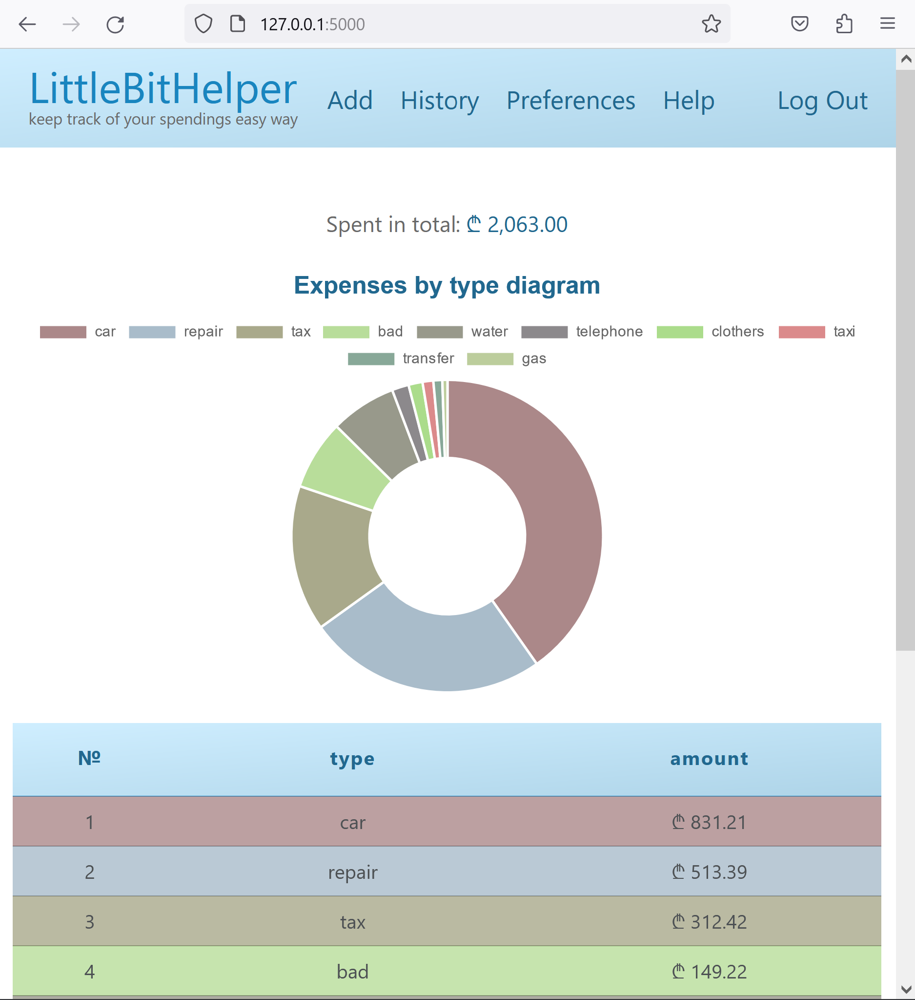
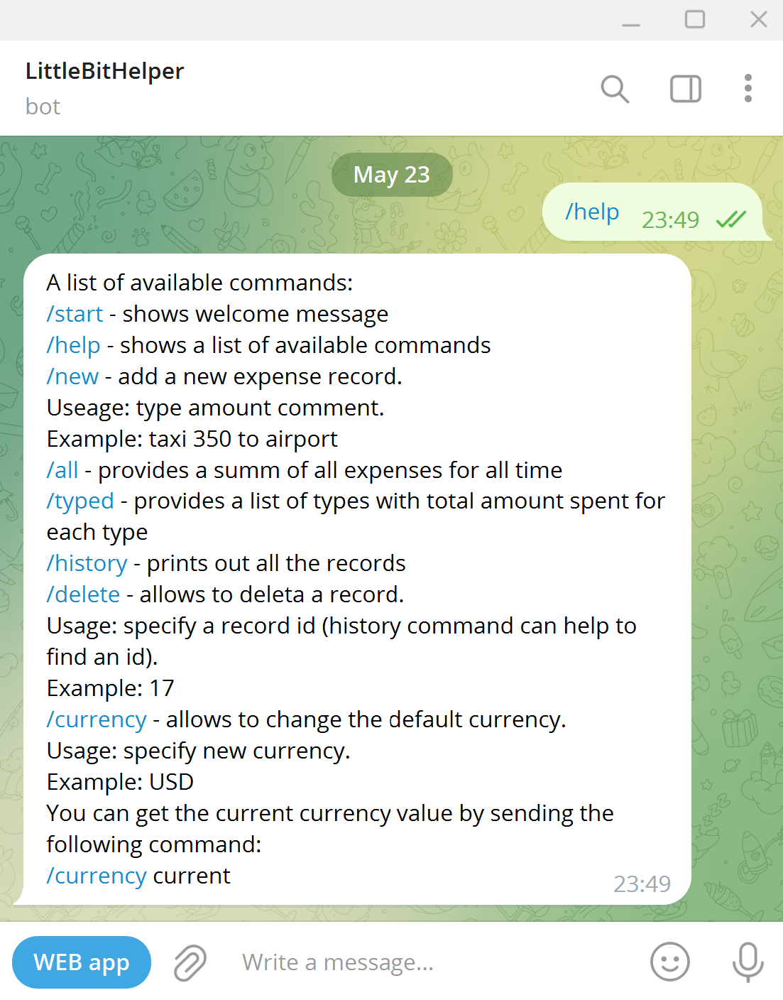
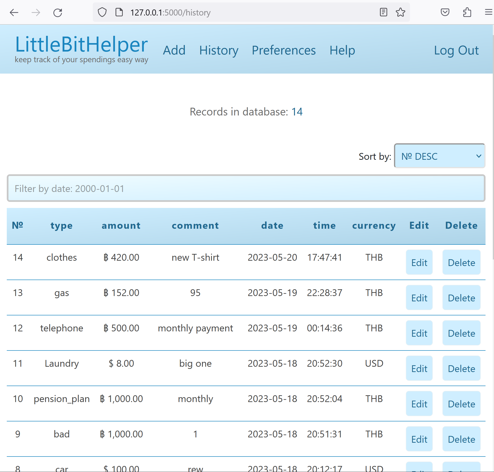

# "LittleBitHelper". A web app for expense tracking with Telegram bot integration
#### Video Demo:  https://youtu.be/a8twg-OPZRM
## **Description**:

The LittleBitHelper Web App designed to make your expense tracking easy. You can add your spendings records to the app via web interface as well as via Telegram bot. Then you can get the overall amount spent, total amount by category, records filtered by date and more.

Telegram bot is the on-the-go tool to add and read your records while web interface is more informative and loaded tool with enhanced functionality.


Telegram bot and web app work together. However, once a user account is created they can be used separately with no limitations. To get the greatest user experience it is recommended to combine usage of both tools.

If you have any questions or suggestions don't hesitate to reach me out via [GitHub](https://github.com/ivang5711)
or [Telegram](https://t.me/Girsov) or [email](girsovivan@outlook.com)

### **User interface screenshots**

<details>
  <summary><i>show/hide</i></summary>

  

</details>


# **Technical details**

### **Project structure**
The project consists of the following files:
```
📦project
 ┣ 📂flask_session
 ┣ 📂static
 ┃ ┣ 📜favicon.ico
 ┃ ┣ 📜map.js
 ┃ ┗ 📜styles.css
 ┣ 📂templates
 ┃ ┣ 📜about.html
 ┃ ┣ 📜add.html
 ┃ ┣ 📜apology.html
 ┃ ┣ 📜history.html
 ┃ ┣ 📜index.html
 ┃ ┣ 📜layout.html
 ┃ ┣ 📜login.html
 ┃ ┣ 📜preferences.html
 ┃ ┗ 📜register.html
 ┣ 📜README.md
 ┣ 📜app.py
 ┣ 📜data.json
 ┣ 📜expenses.db
 ┣ 📜helpers.py
 ┗ 📜not.py
```
### **Implementation details**

The web app is written in Python using Flask. Also the project contains  Javascript,
SQL, HTML and CSS code, and uses Bootstrap for the navigation bar, and AJAX chart script via CDN.
Exchange rates obtained via Openexchangerates web API.
Telegram integration via Telegram Bot API.
Terminal debug messages are colored with cprint function.
All the python code is checked with VS Code extension "flake8" which helped to align the code with PEP8 guidelines. HTML and CSS code checked with the validator.w3.org online check tool.
To run app.py you need to type in flask run in your terminal.
To run bot.py you need to type python bot.py in your terminal.
The apps can work independantly as long as they share the same database.

#### **database**
All the user data contains in a single database expenses.db.
The database consists of two tables:
users and expenses
Users table contains user telegram ID and uses it as login, user's password hash and
default currency. Default value for the currency is USD.
Expenses table collects all the user's records and consists of user's telegram id,
autoincremented id, type, amount, comment, date, time, currency.

<details>
  <summary><i>show/hide</i></summary>


</details>

#### **app.py**
app.py file contains main code of the web application.
On startup the file sets session logging parameter to "fylesystem" and stores user sesion data in the flask_session folder. Also it sets the session lifetime to 24 hours. After that time period a user will be automaticallu log out and will have to login again. Also app connects to the expenses database.

If a user tries to open a website the index page will be displayed but if the user is not logged in the app will redirect the user to the log in page. This behavior is managed by login_required function. This function was adopted from the CS50 project with minimum changes. Every page except the page "about" has this access protection.

On the index page a user's summary is provided. The summary is a table and a chart with the user's records grouped by type.
One of the interesting features here is that the total amount is calculated correctly even though the currencies of a certain records could be different. This is done by means of applying double conversion. First the currency converts to the USD, then it converts to the current default currecny of a user. USD is choosen because this is the base currency for the Openexchangerates.org data.

Also to make the groups be more visualy distinguishable the random colour generator is implemented on the back end. The values generates in app.py and transferes to the HTML via jinja. There they converts to the javascript variables and passes to the AJAX chart script and HTML table rows style parameters. This allows to get the same color across both chart and table and to make it random dynamically.

On the History page the w3 schools cript is used to filter the table by date. The sorting mechanism based on the separate Javascript functions located in the map.js file.

Edit and delete buttons next to each record allow to update and delete the database. The database protection is bade by using the user session id as a request parameter in SQL. This ensures a user can not access the records of other users.

<details>
  <summary><i>show/hide</i></summary>

``` python

# Provides a page with all the user's history
@app.route("/history", methods=["GET", "POST"])
@login_required
def history():
    # Show history grouped by type
    cprint(f"@hystory(): {base_check()}", "cyan")
    # Gets the current session's user ID
    uid = int(session['tg_id'])
    listOfKeys = keys()
    # Sets the edit mode variable to 0
    edit_mode = 0
    # Checks if the user gets to the page via POST method
    if request.method == "POST":
        print("@history(): hey POST")
        # Tries to define which input was submitted to get to this page
        try:
            request.form["delete"]
            mode = "delete"
        except HTTPException:
            print("@history(): mode: NOT delete")
        try:
            request.form["edit"]
            mode = "edit"
        except HTTPException:
            print("@history(): mode: NOT edit")
        try:
            request.form["new_type"]
            mode = "update"
        except HTTPException:
            print("@history(): mode: NOT update")
        print("@history: try result = ", mode)
        # Checks if the input is valid and defines the form submitted
        if mode == "delete":
            toDelete = request.form["delete"]
            print("@history(): FROM delete", toDelete)
            # Checks if the input shares are digits
            if not toDelete.isdigit():
                return apology("not a digit", 400)
            # Checks if the shares amount is provided and correct
            if ((not request.form["delete"]) or
                (float(request.form["delete"]) < 1) or
                    ((float(request.form["delete"]) % 1) != 0)):
                return apology("must provide a correct number "
                               "of shares to buy", 400)
            # Stores the input into a variable
            cprint(f"@history: {toDelete}", "cyan")
            # Prints out the record with the given ID to the terminal
            usersbase = db.execute('''SELECT id, type, amount,
                                comment, date, time, users_id
                                FROM expenses WHERE id = (?);''', (toDelete,))
            cprint(f"@history: {usersbase[0]}", "cyan")
            # Deletes a record from the expenses table
            usersbase = db.execute('''DELETE FROM expenses
                                WHERE id = (?);''', (toDelete,))
        if mode == "edit":
            edit_mode = 0
            toEdit = request.form["edit"]
            print(f"@history(): FROM edit {toEdit}")
            cprint(f"@history: {toEdit}", "cyan")
            # Prints the selected record to the terminal
            usersbase = db.execute('''SELECT id, type, amount,
                                comment, date, time, users_id, currency
                                FROM expenses WHERE id = (?);''', (toEdit,))
            cprint(f"@history: {usersbase[0]}", "cyan")
            # Declare the lists for the variable storage
            nid = []
            tgid = []
            type = []
            amount = []
            comment = []
            date = []
            time = []
            curren = []
            iterations = len(usersbase)
            # Populates the lists with values from the joined tables
            for i in range(iterations):
                nid.append((usersbase[i])["id"])
                tgid.append((usersbase[i])["users_id"])
                type.append((usersbase[i])["type"])
                amount.append((usersbase[i])["amount"])
                comment.append((usersbase[i])["comment"])
                date.append((usersbase[i])["date"])
                time.append((usersbase[i])["time"])
                curren.append((usersbase[i])["currency"])
            # To have the current record's currency at the first place in the
            # dropdown menu creates a new list with the first element equal to
            # the current record currency
            temporaryCurrencyList = []
            temporaryCurrencyList.append(curren[0])
            # Appends the rest of the available currency
            # abbreviations to the list
            for i in range(len(listOfKeys)):
                temporaryCurrencyList.append(listOfKeys[i])
            print("@history(): ", temporaryCurrencyList[0])
            listOfKeys = temporaryCurrencyList
            # Renders the history page
            return render_template("history.html", nid=nid, tgid=tgid,
                                   type=type, amount=amount, comment=comment,
                                   date=date, time=time, iterations=iterations,
                                   cur=cur, curren=curren,
                                   edit_mode=edit_mode, listOfKeys=listOfKeys)
        # If the mode is Update:
        if mode == "update":
            print("@history(): I'm in")
            print("@history(): FROM INPUT:")
            # Populates variables with the new values
            # converting them to the proper types correspondingly
            new_type = str(request.form["new_type"])
            new_amount = str(request.form["new_amount"])
            new_comment = str(request.form["new_comment"])
            new_currency = str(request.form["new_currency"])
            new_id = int(request.form["new_id"])
            print("@history(): ", new_type)
            print("@history(): ", new_amount)
            print("@history(): ", new_comment)
            print("@history(): ", new_currency)
            print("@history(): ", new_id)
            print("@history(): that's all")
            # Gets the record with the selected ID from the expenses database
            usersbase = db.execute('''SELECT *
                                FROM expenses
                                WHERE id = (?);''', (new_id,))
            # Populates the variables with the values from the selection
            originalCurrency = usersbase[0]['currency']
            originalType = usersbase[0]['type']
            originalAmount = usersbase[0]['amount']
            originalComment = usersbase[0]['comment']
            cprint(f"@history: {originalCurrency}", "cyan")
            # Checks if there was no changes made to the input forms
            if ((str(new_currency) == str(originalCurrency))
                and ((str(originalType) == str(new_type))
                     or (str(new_type) == ""))
                and ((str(originalAmount) == str(new_amount))
                     or (str(new_amount) == ""))
                and ((str(originalComment) == str(new_comment))
                     or (str(new_comment) == ""))):
                cprint("@history(): all the fields remain the same. "
                       "No change required", "red")
            # If the changes were made to any of the field and the
            # new values do not match the previous ones
            else:
                cprint("@history(): Changes have to be applied!!!", "yellow")
                if new_type == "":
                    new_type = originalType
                if new_amount == "":
                    new_amount = originalAmount
                if new_comment == "":
                    new_comment = originalComment
                # Updates the record with the given ID in the expenses table
                db.execute('''UPDATE expenses
                           SET type = ?, amount = ?, comment = ?,
                           currency = ? WHERE id = ?;''', new_type,
                           new_amount, new_comment, new_currency, new_id,)
    # If the user gets to the page via "GET" request
    else:
        print("hey GET")
    # Reads all the records from the database for the current user ID
    usersbase = db.execute('''SELECT id, type, amount, comment,
                           date, time, users_id, currency
                           FROM expenses
                           WHERE users_id = (?) ORDER BY id DESC;''', (uid,))
    # Declare the lists for the variable storage
    nid = []
    tgid = []
    type = []
    amount = []
    comment = []
    date = []
    time = []
    curren = []
    iterations = len(usersbase)
    # Populates the lists with values from the joined tables
    for i in range(iterations):
        nid.append((usersbase[i])["id"])
        tgid.append((usersbase[i])["users_id"])
        type.append((usersbase[i])["type"])
        amount.append((usersbase[i])["amount"])
        comment.append((usersbase[i])["comment"])
        date.append((usersbase[i])["date"])
        time.append((usersbase[i])["time"])
        curren.append((usersbase[i])["currency"])
    # Sets the edit mode to 1
    edit_mode = 1
    # Renders the history page
    return render_template("history.html", nid=nid, tgid=tgid, type=type,
                           amount=amount, comment=comment, date=date,
                           time=time, iterations=iterations,
                           cur=cur, curren=curren, edit_mode=edit_mode)

```

</details>

Basically most all the pages use GET and POST requests to interact with user rendering a certain HTML page or redirecting to another HTML page.

#### **helpers.py**
helpers.py file contains auxilary functions to make the main app.py file cleaner and to separate the main logic fro the common functions.
The base_check() function is particularly interesting:

<details>
  <summary><i>show/hide</i></summary>

```Python

# Checks JSON file and updates it if necessuary
def base_check():
    # Opening JSON file
    f = open('data.json', "r")
    try:
        data = json.load(f)
        check = data['timestamp']
        cprint(f"@base_check: check: {check}", "magenta")
    except ValueError:
        # In case of an error sets the timestamp to the obviously wrong date
        check = 1111111111
        cprint(f"@base_check: no data {check}", "magenta")
    f.close()
    time_stamp = check
    cprint(f"@base_check: Timestamp: {time_stamp}", "magenta")
    date_time = date.fromtimestamp(time_stamp).isoformat()
    cprint(f"@base_check: The date is: {date_time}", "magenta")
    ts = date.today().isoformat()
    cprint(f"@base_check: Today is: {ts}", "magenta")
    flag = 0
    cprint("@base_check: flags:", "magenta")
    # A series of checks compares the timestamp with current date
    if date_time == ts:
        flag = 1
        cprint(f"@base_check: {flag}", "magenta")
        fd = "JSON is up to date"
        cprint(f"@base_check: {fd}", "green")
        return fd
    else:
        flag = 0
        cprint(f"@base_check: {flag}", "magenta")
    if flag == 0:
        # If the timestamp does not match then send a request via API
        # Contact API
        dat = date.today().isoformat()
        url = (f"https://openexchangerates.org/api/historical/{dat}.json?ap"
               "p_id=b3ce64356fea4b50abde8cbb5ac61474&show_alternative=fa"
               "lse&prettyprint=false")
        headers = {"accept": "application/json"}
        response = requests.get(url, headers=headers)
        cprint(f"@base_check: Response {response}", "yellow")
        newdict = json.loads(response.text)
        err = "JSON update error"
        # Tries to get the data from the recieved response
        try:
            cprint(f"@base_check: {newdict['rates']}", "magenta")
        except KeyError:
            # Returns an error message if failed
            cprint("@base_check: JSON error", "red")
            cprint(f"@base_check: {dat}", "magenta")
            return err
        # If no errors writes down the data to the JSON file
        data = newdict
        with open('data.json', 'w', encoding='utf-8') as f:
            json.dump(data, f, ensure_ascii=False, indent=4)
        cd = "JSON updated successfully!"
        cprint(f"@base_check: {cd}", "green")
        return cd

```

</details>

In this function the exceptions are managed in a proper way so if the ValueError or KeyError arise the except scenario executed properly.

#### **data.json**
data.json file contains a dump of the exchange rate data for a given day. The data obtained from the Openexchangerates.org website via their web API. The service provides an option to download a certain rate or the whole list of rates for a given date. The request amount is limited for the free accounts. Because of that it was decided to download all the rates and store them locally in the data.json file to get access to them with no additional "fee" or waste of request count.

#### **templates folder**
folder "templates" contains all the HTML pades. The index.html is the main page and the others designed to extend it. This is done by using Flask and Jinja.

#### **static folder**
Static folder contains styles.css file where all the css propertie are located. The folder also contains map.js for the external Javascript code and favicon.ico file for the browser tab decoration.

#### **bot.py**
finally the root folder contains the bot.py where all the Telegram bot related code is located. The code uses aiogram - a modern and fully asynchronous framework for Telegram Bot API written in Python 3.8. More details here: [aiogram](https://github.com/aiogram/aiogram)

On startup bot.py imports Telegram bot's API Token. You can connect your bot by importing it's API Token to the bot.py at startup. Look here for more details: [Telegram Bot API](https://core.telegram.org/bots/api)

After that it tries to create the expenses.db. The IF NOT EXISTS parameter in the sql request ensures the databse would not be overwritten if it already exists or if the app will exit with an exception.

<details>
  <summary><i>show/hide</i></summary>

``` python

# Tries to create a new database. Skips if the DB is already exists
con = sqlite3.connect('expenses.db')
cprint("@initialization: Opened database successfully", "blue")
con.execute('''CREATE TABLE IF NOT EXISTS expenses (
    id INTEGER PRIMARY KEY AUTOINCREMENT,
    type TEXT NOT NULL,
    amount INT NOT NULL,
    comment TEXT,
    date TEXT NOT NULL,
    time TEXT NOT NULL,
    users_id INTEGER NOT NULL,
    currency TEXT NOT NULL DEFAULT 'USD',
    FOREIGN KEY(users_id) REFERENCES users(id)
    ); ''')
cprint("@initialization: Table EXPENSES ready", "blue")
con.close()
con = sqlite3.connect('expenses.db')
con.execute('''CREATE TABLE IF NOT EXISTS users (
    id INTEGER PRIMARY KEY AUTOINCREMENT NOT NULL,
    tg_id TEXT NOT NULL,
    hash TEXT NOT NULL,
    default_currency TEXT NOT NULL DEFAULT 'USD'
    ); ''')
cprint("@initialization: Table USERS ready", "blue")
con.close()

```

</details>

Once a user start the Telegram bot or sends a message the bot checks if the user is registered. No password required since the app checks the user's Telegram ID which it obtains via each user's message automatically.

If the user is not registered the only command available is /start. This command returns to the user the user's Telegram ID and a welcome message.

Once the user registers via Web App the /start command changes the response and shows the list of helpful commands.

When user sends a command the bot.py process it with a corresponding handler.
All the handlers have filters to "recognize" a certain command.
Once the command recognized the code inside the handler is executed.

As an illustration let's take a look at the /new command.

The command must be executed with 2 mandatory and 1 optional parameters.
A user must provise a single word representing the type of expense. after the first word the amount spent and after that any number of any symbols as a comment.

The /new handler parses the string provided by user and creates 3 variables to store the corresponding data. If it fails to parse that quite likely means the input is incorrect and the handler returns a mesage to the user with the brief guide of how to provide data to the command. If the command executed successfully the corresponding message sends to the user.

<details>
  <summary><i>show/hide</i></summary>

``` python

# Add new record to the expenses table
# This handler will be called when user sends `/new` command
@dp.message_handler(commands=['new'])
@check
async def add_new(message: types.Message):
    # Gets user's ID
    user = types.User.get_current()
    userId = int(user['id'])
    # Gets user's message from bot
    messageString = ""
    messageString = message.text
    typeArray = []
    amountArray = []
    commentArray = []
    # Parses the user's message from string to the separate arrays
    flag = 0
    for i in range(5, len(messageString)):
        if messageString[i] != " " and flag == 0:
            typeArray.append(messageString[i])
        elif messageString[i] == " " and flag == 0:
            flag = 1
        elif messageString[i] != " " and flag == 1:
            amountArray.append(messageString[i])
        elif messageString[i] == " " and flag == 1:
            flag = 2
        elif flag == 2:
            commentArray.append(messageString[i])
    # converts the arrays to strings
    type = ""
    for i in range(len(typeArray)):
        type += typeArray[i]
    amount = ""
    for i in range(len(amountArray)):
        amount += amountArray[i]
    comment = ""
    for i in range(len(commentArray)):
        comment += commentArray[i]
    # Checks if the amount provided is digit
    if amount.isdigit():
        cprint("@add_new: yes, is digit", "blue")
        # Checks if the amount provided is greater than zero
        if int(amount) > 0:
            cprint("@add_new: amount > 0 and is valid", "blue")
            cprint(f"@add_new: {type, amount, comment}", "blue")
            # Gets date and time in ISO format
            dateISO = date.today().isoformat()
            dtn = datetime.now()
            timeISO = dtn.strftime("%H:%M:%S")
            cprint("@add_new: Opened database successfully", "blue")
            # Gets a user's default currency value
            currency = defaultCurrency(message)
            cprint(f"@add_new: {str(currency)}", "blue")
            # Adds new record to the expenses table
            con = sqlite3.connect('expenses.db')
            con.execute('''INSERT INTO expenses (
                type, amount, comment, date, time, users_id, currency)
                VALUES (?, ?, ?, ?, ?, ?, ?
                );''', (type, amount, comment, dateISO,
                        timeISO, userId, currency))
            con.commit()
            con.close()
            cprint("@add_new: Records created successfully", "blue")
            # prints the message if the insert was successfull
            await message.answer("New record added successfully")
        else:
            # Prints the error message if the value provided is less
            # or equal to zero
            cprint("@add_new: the valuse is = or less than 0", "blue")
            await message.answer("Please provide expense "
                                 "value greater than 0")
    else:
        # Prints an error message if the amount value provided is
        # not a digit
        cprint("@add_new: no, not a digit", "blue")
        await message.answer("Please provide input in the "
                             "following format: "
                             "\ntype amount comment"
                             "\nExample:\n/new taxi 125 trip from Airport")
                             

```
</details>

### **Dependencies**

- aiogram
- cs50
- datetime
- flask
- functools
- json
- logging
- random
- requests
- sqlite3
- termcolor
- werkzeug.exceptions
- werkzeug.security

# **Interface and features overview**

In order to use the app you need to register first.
## **Register a new user**

To register a new user follow these steps:
### **step 1**

To create a new account you need to provide your Telegram ID. This is a unique number given by Telegram to each user. To get your Telegram ID you can simply start a conversation with the LittleBitHelperBot.

If you are not registered yet the bot will provide your Telegram ID in the very first message.
### **step 2**

Go to the registration page and fill it your Telegram ID in the Telegram ID field. It will be used as a login. Then create a strong password and fill in confirmation box. Then press register.
### **step 3**

After registration is complete you will be redirected to the login page. Fill in the login boxes with your Telegram ID and password correspondingly and press login. If the login is successful you will see the main page with your records summary.
## **Web interface**

Let's make a quick overview of the web interface.
### **Home page**

The first page is the summary page. It provides a table and a chart representing your expenses grouped by type. More on this later in this section. If you do not have records yet there would not be anything to show. All the info appears as you add your first record. Why don't we add one? To do this we should go to the Add page.
### **Add page**

On the Add page you can use the boxes and a drop down menu to add a new record. There are a couple of rules to follow.

The "type" field allows a single word only. The word can contain any symbol except spaces. This field intended to categorize your expenses by the type provided. There is no limit on the type amount. However, it is recommended to stick to the reasonably limited amount of types for the sake of the presentability of the statistics results and overall visual convenience.

The "amount" field can contain only numbers. Here you must provide a number greater than 0.

The "comment" field is optional. Us it as you think best. A suggestion here is to use it to add some specific to the record. This can help to use search in future when the amount of records becomes high.

Also there is a drop down list where you can pick a currency of the record. If you leave this field default then the current default currency will be applied. For all the new users the default currency is preset to USD. You can change your default currency to any currency on the Preferences page.
### **History page**

On the History page you can see a list of all your records. By default it sorted from the most recent to the oldest ones. You can choose other sorting type in the drop down menu on the top right corner of the table.

Next to each record there are two buttons: a Delete button and an Edit button.

The Delete button does exactly what it meant to do - deletes a record.

The Edit button provides an interface to edit a particular record. You can change any parameter except the date and time. These remain the same for security reasons. Remember the type and amount fields are mandatory. After edit is complete click on the Submit button and you will be redirected back to the History page.
### **Preferences page**

On the Preferences page you can change you default currency. Pick one from the drop down list and click Submit. The currency symbol and USD to the selected currency rate will appear on the page. The currency rates updates once a day and provided by Openexchangerates.
### **Help page**

Finally here you can find some info about the web app and some guides to start using it. If you have any questions or want to provide some feedback - you can do it via GitHub
## **Telegram bot**

The Telegram bot is an accessible tool to track expenses on the go as easy as possible without using additional app. Telegram can be installed on any platform either desktop or mobile and the user experience is quite natural for telegram (or any other messenger) users. It is just as simple as a regular chat in a messenger!
### **Getting started**

You have to be registered in the web interface first in order to use LittleBitHelperBot. See register section of this page to create an account. Once registered you can start using LittleBitHelperBot with no limitations.

Now send "/start" command to the bot. It will send a greeting back to you. Send "/help" command to see the list of available commands with description and usage examples. See Available commands section to learn more about all the available commands.
### **Available commands**

#### /start

Shows welcome message

#### /help

Shows a list of available commands

#### /new

Adds a new expense record. Usage: type amount comment. Example:/new taxi 350 to airport
The same rules as for the web interface apply to the telegram bot. Therefore the type field must contain of a single word. Any symbol is allowed for the type field except the "space" symbol.
value field is mandatory too. It must contain digits only and must be grater than 0.
The comment field is optional and can contain any amount of any symbols including the "space" symbol. That means it can consists of multiple words.
The input scheme should look like this:

| /new | type | amount | comment |
|------|------|--------|---------|
| /new | food | 20     | my 1'st tasty burger... mmm

The example above is a valid input for the /new command. With the correct words provided separated by spaces the record will be submitted with no errors.

#### /all

Provides a sum of all expenses for all time.

#### /typed

Provides a list of types with total amount spent for each type.

#### /history

Prints out all the records.

#### /delete

To delete a record you must provide an ID of the record. To get the ID you can send the /history command first, find the record of your choice, and pass it's id to the delete command.
For example: /delete 78.

#### /currency

Use this command to see and update the current default currency. To see the current value sent /currency current command.
To change the current default currency to USD send /currency USD.
To change to Euro send /currency EUR. If the currency sent is invalid a message will inform you.

If you have any questions or suggestions don't hesitate to reach me out via [GitHub](https://github.com/ivang5711)
or [Telegram](https://t.me/Girsov) or [email](girsovivan@outlook.com)

API provided by https://openexchangerates.org
